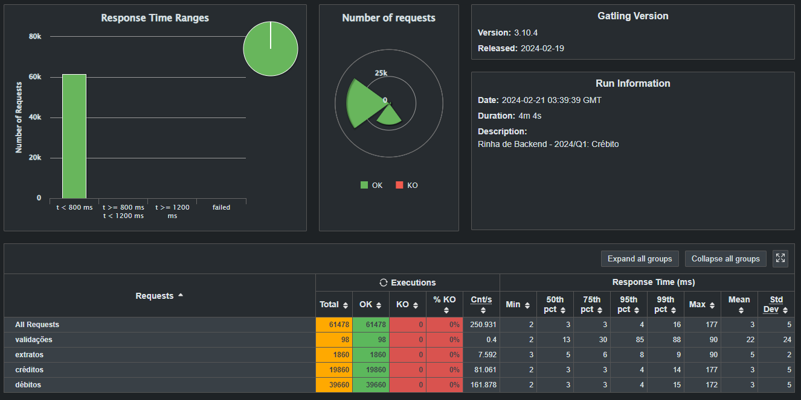
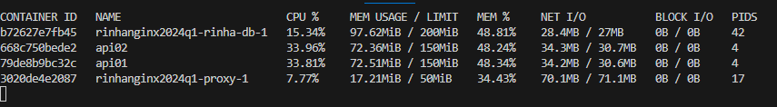

APi para o desafio da Rinha de backend edição 24-Q1

Solução usando FastApi, ˜˜sqlalchemy˜˜, postgres(psycopg2) e ˜˜traefik˜˜(trocado porsteriomente por nginx)

Algumas observações
 - o sqlalchemy não conseguiu peformar bem para a necessidade da rinha, então removi
 - o traefik consumiu muita memoria. O nginx fez absurdo consumido pouco mais de 15mb
 - optei por não usar a injeção de dependência do fastapi e manualmente abria a conexão no services. (isso fez muita diferenças)
 - concentrei a race condition somente na geração de saldo utilizando function no postgres com um lock por registro da tabela cliente. (não tinha condição de race condition para transação )
 - alguns tunning no postgres =)

## Resultado

## Consumo de recursos

